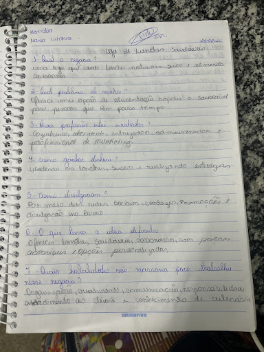

# Loja-de-Lanches-Saud-veis
É uma empresa ,para vende lanche naturais e alimentos saudável ,oferece uma opção de alimentação rápido e saudáveis para pessoas que tem pouco tempo. 
<!DOCTYPE html>
<html lang="pt-BR">

<head>
    <meta charset="UTF-8">
    <meta name="viewport" content="width=device-width, initial-scale=1.0">

    <title>Loja de Lanches Saudáveis</title>

    
</head>

<body>

    <header>
        <h1>🥗 Loja de Lanches Saudáveis</h1>
        
Sabor, saúde e qualidade em cada mordida!

    </header>

    <nav>
        <a href="#inicio">Início</a>
        <a href="#produtos">Produtos</a>
        <a href="#sobre">Sobre nós</a>
        <a href="#contato">Contato</a>
    </nav>

    <section class="banner" id="inicio">

        

        <h2>Alimente seu corpo com saúde!</h2>

        

            Lanches deliciosos, naturais e preparados
            para deixar seu dia mais saudável.
        

        <a href="#produtos" class="botao">
            Ver nossos produtos
        </a>

    </section>

    <section class="produtos" id="produtos">

        <h2>Nossos Lanches</h2>

        

            

                <h3>🥪 Sanduíche Natural</h3>

                

                    Pão integral, frango desfiado,
                    alface, tomate e ingredientes frescos.
                

                
R$ 12,00

            

            

                <h3>🍓 Iogurte com Frutas</h3>

                

                    Iogurte natural com frutas frescas
                    e granola.
                

                
R$ 10,00

            

            

                <h3>🍌 Smoothie Natural</h3>

                

                    Bebida preparada com frutas naturais
                    e ingredientes selecionados.
                

                
R$ 11,00

            

            

                <h3>🥗 Salada de Frutas</h3>

                

                    Combinação deliciosa de frutas
                    frescas para qualquer momento do dia.
                

                
R$ 9,00

            

        

    </section>

    <section class="sobre" id="sobre">

        <h2>Sobre Nós</h2>

        

            Nossa loja nasceu com o objetivo de oferecer
            opções de lanches saborosos e mais saudáveis.
            Trabalhamos com ingredientes frescos e buscamos
            oferecer qualidade e praticidade para nossos clientes.
        

    </section>

    <section class="sobre" id="contato">

        <h2>Entre em Contato</h2>

        

            📱 WhatsApp: (00) 00000-0000
        

        

            📧 E-mail: contato@lanchessaudaveis.com
        

    </section>

    <footer>
        

            © 2026 Loja de Lanches Saudáveis
        

    </footer>

</body>

</html>
